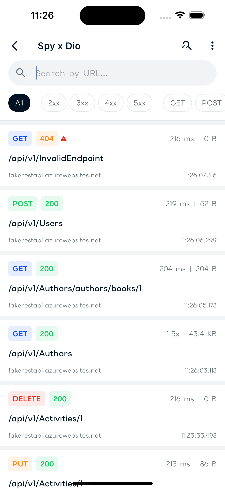
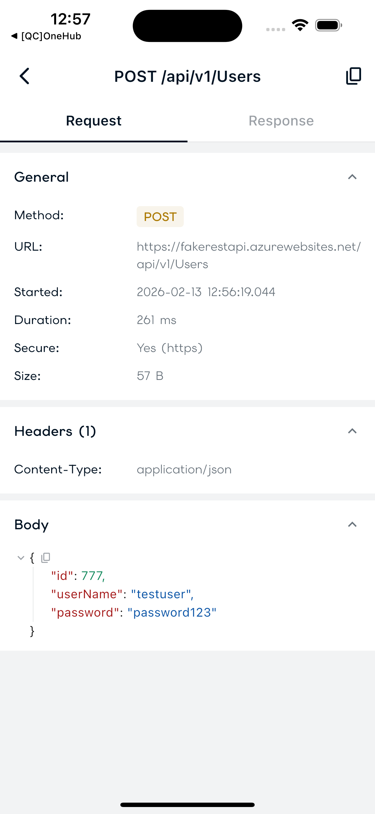
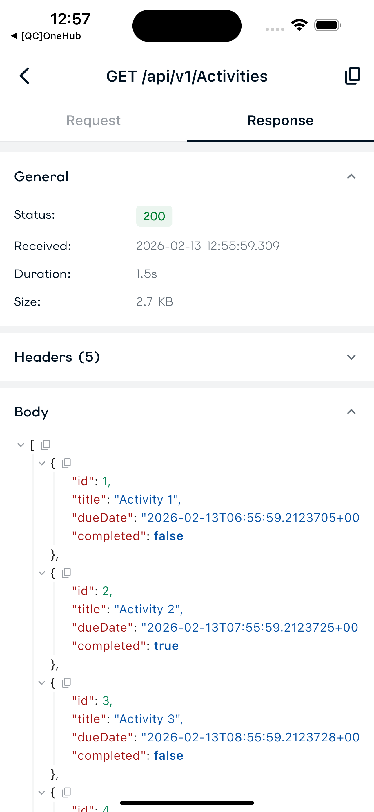
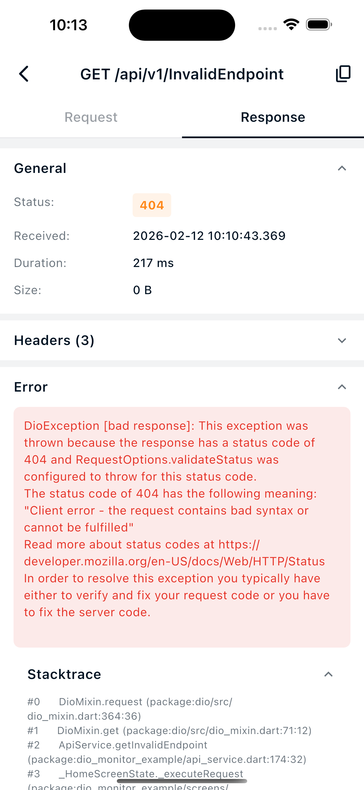

# DioSpy

A lightweight HTTP inspector for Dio with a clean minimal UI. Monitor and debug your HTTP calls with ease!

## Features

- ✨ **Automatic Request Capture** - Intercepts all Dio HTTP calls automatically
- 📱 **Shake to Inspect** - Open the inspector by shaking your device/simulator
- 🎨 **Clean Minimal UI** - Beautiful, easy-to-use interface
- 📋 **Copy as cURL** - Copy any request as a cURL command
- ⚡ **Request Timing** - See how long each request takes
- 🎯 **Quick Filter** - Quickly find your requests by URL, HTTP method and status code
- 💾 **In-Memory Storage** - Configurable circular buffer (default: 1000 calls)
- 🌳 **JSON Visualizer** - Interactive JSON tree viewer

## Screenshots

<table style="border-spacing: 20px;">
  <tr>
    <td align="center" style="padding: 15px;">
      <br/>
      <sub><b>Call List Screen</b></sub>
    </td>
    <td align="center" style="padding: 15px;">
      <br/>
      <sub><b>Request Details</b></sub>
    </td>
  </tr>
  <tr>
    <td align="center" style="padding: 15px;">
      <br/>
      <sub><b>Response Details</b></sub>
    </td>
    <td align="center" style="padding: 15px;">
      <br/>
      <sub><b>Error Handling</b></sub>
    </td>
  </tr>
</table>

## Installation

Add this to your `pubspec.yaml`:

```yaml
dependencies:
  dio_spy: ^0.0.4
```

Then run:

```bash
flutter pub get
```

## Quick Start

### 1. Initialize DioSpy

```dart
import 'package:dio/dio.dart';
import 'package:dio_spy/dio_spy.dart';

// Create DioSpy instance
final dioSpy = DioSpy(
  showOnShake: true,  // Enable shake gesture
  maxCalls: 1000,     // Max number of calls to store
);
```

### 2. Add Interceptor to Dio

```dart
final dio = Dio();

// Add DioSpy interceptor
dio.interceptors.add(dioSpy.interceptor);
```

### 3. Connect the Inspector UI

You have two options to display the inspector:

#### Option A: DioSpyWrapper (Recommended)

Use `DioSpyWrapper` in your `MaterialApp.builder`. No navigator key needed.

```dart
MaterialApp(
  builder: (context, child) => DioSpyWrapper(
    dioSpy: dioSpy,
    child: child!,
  ),
  home: MyHomePage(),
);
```

#### Option B: Navigator Key

Pass a `GlobalKey<NavigatorState>` so DioSpy can push the inspector as a route.

```dart
final navigatorKey = GlobalKey<NavigatorState>();

MaterialApp(
  navigatorKey: navigatorKey,
  home: MyHomePage(),
);

dioSpy.setNavigatorKey(navigatorKey);
```

### 4. Make HTTP Requests

All requests made through your Dio instance will be automatically captured!

```dart
final response = await dio.get('https://api.example.com/users');
```

### 5. Open the Inspector

- **Shake your device** - The inspector will open automatically
- **Open it programmatically** - `dioSpy.showInspector()`
- **Close it programmatically** - `dioSpy.hideInspector()`

## Complete Example

See the [example](example/) folder for a complete working app that demonstrates:

- GET, POST, PUT, DELETE requests
- Error handling
- Different response types
- Using the FakeRESTApi for testing

## Requirements

- Dart SDK: `^3.0.0`
- Flutter: `>=3.10.0`
- Dio: `>=5.0.0 <6.0.0`

## Limitations

- **In-Memory Only** - Calls are not persisted between app restarts
- **No Network Modification** - This is a monitoring tool only, it doesn't modify requests

## Contributing

Contributions are welcome! Please feel free to submit a Pull Request.

## Credits

Inspired by other HTTP debugging tools like Chuck (Android) and Network Inspector (iOS).
